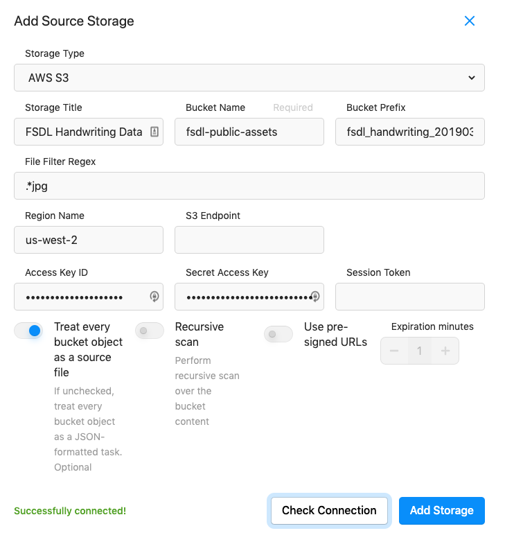
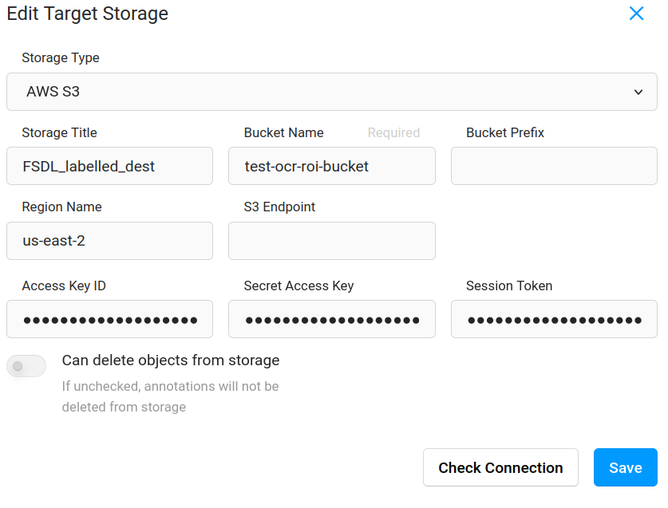
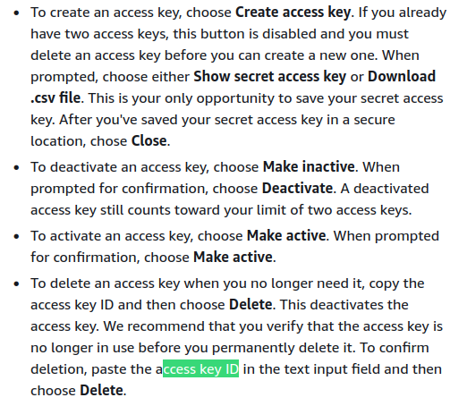

### Data Annotation 

----

##### **Importance of working with data**

Data is persisted in raw form like xml but that needs to be 

The data that is annotated is as rich as possible meaning in this case of handwritten text it would be use full is the data is annotated at the level of individual lines and more better if annotated at individual words/characters. This can help in augmenting data by combining lines from different paragraphs to creates new data samples so effectively synthesizing new data.

Knowing data well will help you understand the task that is being planned and the model that is being trained. 

##### **ngrok**  

- This is a reverse proxy service , which in simple words puts your local-host service on the web. You don't have to worry of about port-forwarding or knowledge of firewalls
- This helps in setting up a web service

##### **Installing label-studio using docker :**

- using `docker pull`[[url](https://docs.docker.com/engine/reference/commandline/pull/)] to pull the image from the registry  and then `docker run` to run the container

  The following two commands can be used 

  - This pulls the latest image from the docker label-studio registry[[ref](https://www.educba.com/docker-pull/)]. The text after `: ` a tag, which points to the version that ones needs to pull

  In this case the tag is `latest`

  `docker pull heartexlabs/label-studio:latest`

  - This runs the container with its own isolated file-system, networking  and process(that are separate from the host process tree)[[ref](https://docs.docker.com/engine/reference/run/)]

    `docker run -it -p 8080:8080 -v $LABEL_STDIO_DATA/mydata:/label-studio/data heartexlabs/label-studio:latest`

LABEL_STDIO_DATA is a folder imported into the ~./profile file pointing to a folder where the data will be persisted. This maps the file-system of the container to that of the local machine

#### Data Labeling

##### Importing unlabeled data into label studio

###### *csv*

upload the manifest.csv file

the manifest.csv file is just a list of url of all the images in the bucket

**or**

###### ***aws S3***

**setting up source storage**

-  `fsdl-public-assets` is a public bucket so it does not require special permissions but requires Access key and Secret key to be generated from the aws account.

  fsdl connection information

  

**setting up destination storage**

- Access key and secret key can be generated using the following steps([url](https://docs.aws.amazon.com/general/latest/gr/aws-sec-cred-types.html))

  

##### Setting up the labeling task

- from settings select the OCR as template
- The change the label to `line` or any other label name depending on the granularity that is needed.
- then select draw rectangular box around a line then enter the text on that label

##### Labeling the data

- draw bounding boxes on each line and enter the text in the label

- once the labeling is finished go to settings to sync the annotation to the destination storage

  

