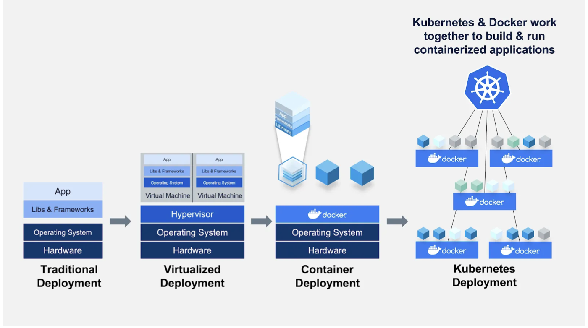
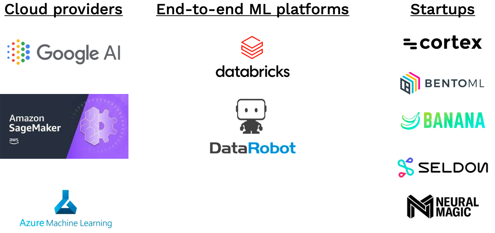

# Deployment: Lecture 05

[toc]

----

- Model deployment is critical as it brings out the flaws and issues in the model and helps in evaluation of the model. 
- With offline evaluation its easy to miss the subtle issues with the model
- Only when the model is deployed that we see if it works well in real-time, ie when it starts interacting with the users or when it starts utilizing real world data.

The mantra for a deployment is 

**Deploy early, deploy often**

**Keep it simple, and add complexity later**

Flow of a model deployment:

- Build a prototype to interact with
- Separate model from UI
- Then scale 
- consider moving the model to edge when speed is essential

## Step 1: **Building prototype to interact with **

- Huggingface playground
- Gradio
- Streamlit

**Best Practices** 

- Have a basic UI

  to get feedback from your colleagues and friends

  - Gradio and Streamlit (slightly complex but more flexible)

- Put it behind a web URL

  - cloud versions of Streamlit and Huggingface are useful

- Just spend a day on i

:x: Cons:

- limited front-end flexibility

- doesn't scale to concurrent requests and the model becomes the bottleneck

**Model-in-service approach** is used by Streamlit and Gradio

the same web service is used to run your model and run your service

:heavy_check_mark:**Pros**: reuses existing infrastructure

:x:**Cons**: Large models eat into resources of the web-server, server hardware not optimized for ML workloads, model and server scale differently, models change more frequently than server code, different language of model and server code

## Step 2: Separate Model from UI

### Batch Prediction

- Periodically run model on new data and save the results in a database

  for e.g.  new flyers come in every week and run the model on that data and store the results in the db

- This is possible in cases where there are relatively less inputs like

  for eg. 1 prediction per user : recommender system

  **Data processing/work flow tools work well here**

  - Run preprocessing
  - load the model
  - run predictions
  - store predictions

  tools: Dagster, Airflow, AWS Step Functions, Perfect, Metaflow

  :heavy_check_mark:**Pros**: simple to implement, scales easily, used in production by large scale production systems for years, fast to retrieve

  :x:**Cons**: Doesn't scale to complex input types, users don't get the most up-to-date predictions, models can frequently become stale

  for e.g. in a recommender system the model will not be able to take into account all the context that the user has provided between the predictions to serve them with updated recommendations

  

###   **Model-as-a Service**

Model is run as its own service separately. Where the service will interact with the backend or the client 

by responding to the requests.

:heavy_check_mark:**Pros**:

**Dependability** model bugs will not crash the whole web-application, 

**Scalability**: choose hardware optimal for the model

**Flexibility:** model can be reused for multiple applications

:x: **Cons**:

**Latency**: adds latency to the application

**Complexity**: adds additional complexity to the application

#### :arrow_right:  **REST APIs**

serve predictions to canonically-formed HTTP requests. Alternatives are <u>GRPC</u> (with Tensorflow Serving) and <u>GraphQL</u>

**No Industry Standard on Rest API for ML services** 

There is no current standard for formatting requests and responses for Rest API calls. Different cloud services have a different approach how the Rest API is structured.

- Google Cloud expects a batch of inputs structured as a list called instances
- Azure and AWS also have a different structure.

#### **:arrow_right: Dependency Management for model servers**

Model predictions depend on code, model weights and dependencies all need to be present on your web server.

Dependency cause trouble

##### **Two Strategies**

1. ***CONSTRAIN THE DEPENDENCY OF YOUR MODEL***

ONNX : standard neural network format

define network in any language and run it consistently anywhere

:x: **Cons:**

- libraries change quickly and often bugs in translation code
- if there is some codel pre-processing, using python code, outside the ML framework then ONNX cannot handle it

2. ***CONTAINERS (i.e Docker)*** :heavy_check_mark:

Dockers vs. VM: 

VMs package the entire OS as well as the libraries and applications that are built on top of that OS

A container like Docker removes that need by packaging the applications and libraries together

- Common pattern is to <u>spin up a docker container for every discrete task</u>

  for example for a web application there might be 4 containers 

  - one for the web-server
  - one for the database
  - one for the job-queue
  - one for the worker

- Docker containers are created from [Docker files](https://docs.docker.com/engine/reference/builder/)

  Docker file runs a sequence of steps to define the environment where the code will run

Docker has three [components](https://docs.docker.com/get-started/overview/)

1. docker client : this is the primary way in which you interact with Docker. When commands such as `docker run` etc are used the client sends these commands to `dockerd`i.e the docker daemon. The `docker` command uses the Docker API.
2. docker daemon: These commands are executed by a **Docker Host**, which can run on either your laptop or your server (with more storage or more performance).
3. docker registry: the docker host talks to the registry where all the container you want are stored

:arrow_forward: Other that docker there are few open source packages to containrize and serve ML models like 

[Cog](https://github.com/replicate/cog), [BentoML](https://github.com/bentoml/BentoML) and [Truss](https://github.com/trussworks)

They have standard way of defining the prediction service and a other is a YAML file the defines other dependencies and package versions that will go into Docker containers running on your laptop.

#### :arrow_right: **Performance Optimization**

Once the basic first iteration model is deployed as  PoC certain optimizations can be carried out to make the model inference more efficient. To <u>improve ML models inference more efficient</u> the following areas must be looked into

##### GPU

:heavy_check_mark:**Pros**:

- GPU provide high throughput when traffic gets large and increase in users

- if same GPU is used during training and inference time any issues of hardware incompatiblity can be eliminated.

:x: **Cons**: they are more complex and expensive

It is not necessary to host the model on a GPU if its trained on a GPU. Early versions of the model would work fine on a CPU.

high through put can be achieved from a CPU it self at low cost

##### CONCURRENCY

The model can be run concurrently on different CPUs or CPU cores on single host machine. This has to have careful thread tuning [[ref](https://robloxfan.club/how-we-scaled-bert-to-serve-1-billion-daily-requests-on-cpus/),[ref](https://www.youtube.com/watch?v=Nw77sEAn_Js)]

##### MODEL DISTILLATION

Once there is a large model a smaller model can be trained that imitates the behaviour of the larger model. Teacher-Student approach is one way of doing it. Model distillation approach can be finicky if done from scratch and not frequently used in practice

Better to use distilled version of popular models (like [DistilBert](https://huggingface.co/docs/transformers/model_doc/distilbert))

##### QUANTIZATION

Approximating a neural network that uses floating-point numbers by a neural network to low bit width numbers like 16-bit or 8-bit. This trade-offs with accuracy but has immense performance and size gains. The accuracy lost if limited relative to performance gain.

Recommended to use built-in quantization methods in [PyTorch](https://pytorch.org/blog/introduction-to-quantization-on-pytorch/) an Tensorflow.

[HuggingFace Optimum](https://huggingface.co/docs/optimum) for HuggingFace pre-trained models.

**Quantization-aware training** can also be done which results in higher accuracy.

##### **CACHING**

If for some models where certain inputs are more common than others the results of the model's inference can be stored in the cache instead of calling the model for everytime.

Basic way of doing caching is [functools library in python](https://docs.python.org/3/library/functools.html) 

##### BATCHING

Higher throughput can be achieved when doing a prediction in parallel in a GPU.

Wait until predictions are accumulated and then run those predictions to return it to user

Complicated to implement, built-in to model hosting services

@josh-tobin

> I wouldn't recommend implementing it on your own. It's complicated because you have to write logic to handle timeouts, max batch size, make sure that the right prediction is being returned to the right caller, etc 
>
> you might want to check out ray serve's implementation if you want to build your own anyway: https://docs.ray.io/en/latest/serve/performance.html#serve-performance-batching-requests

##### SHARING THE GPU

Your model may not take up all of the GPU memory with your inference batch size. **Why don't you run multiple models on the same GPU?** This is a place where you want to use a model serving solution that supports GPU sharing out of the box.

##### LIBRARIES 

There are offerings from TensorFlow, PyTorch, and third-party tools from NVIDIA and Anyscale. NVIDIA's choice is probably the most powerful but can be difficult to get started with. Starting with Anyscale's [Ray Serve](https://docs.ray.io/en/latest/serve/index.html) may be an easier way to get started.

#### **:arrow_right: Horizontal Scaling**

- For scaling the model to interact with large number of users performance optimization of the model on one server is not enough.

- Multiple servers with same copy of the model running are required to handle the traffic. This is called **horizontal scaling**

- A load-balancer distributes traffic to each machine this possible through two methods

  Container Orchestration

  Serverless

  

##### CONTAINER ORCHESTRATION

Kubernetes helps manage containerized applications and run them across machines

Its an overkill to learn about it if the only goal is to deploy ML models

Kubernetes associated frameworks: [Kubeflow](https://www.kubeflow.org/), [Seldon](https://www.seldon.io/)

##### SERVERLESS FUNCTIONS

Package the app code and dependencies in to a docker container. The docker container needs to have one entry point function that runs over and over again. For a ML model this would be `model.predict()`

Then this docker container can be deployed to a service  like AWS lambda or Google Cloud Functions or Azure Functions. These manages everything else scaling , load balancing etc etc

For serverless you pay only for the time that your service is active for 

**<u>This is recommended approach once you pass the prototype application phase</u>**

 :x: **Cons**

- Limited size of deployment package
- cold-start , if there are not requests to the model the serverless function takes a while to load/startup when a new requests comes
- can be difficult to build pipelines and iterate. serverless functions donot have tools to support rapid iteration and automated changes to code
- state management, caching and deployment tooling are challanges here
- CPU only, limited or no GPU support. Alternative solutions like [Banana](https://www.banana.dev/) and [Pipeline](https://www.pipeline.ai/) for serverless GPU inferencing

#### :arrow_right: MODEL ROLLOUTS

1. **Roll out gradually** : incrementally send traffic to new model
2. **Roll back instantly**: immediately pull back if a model is performing poorly
3. **split traffic between versions**: test differences between models
4. **Deploy pipelines of models**: run shadow versions of the new model to test and then rollout the model

Building these capabilities in a reasonably challenging infrastructure problem that is beyond the scope of this course. In short, managed services are a good option

#### :arrow_right: Managed Options

### Summary 

1. You *probably* don't need GPU inference, which is hard to access and maintain. Scaling CPUs horizontally or using serverless can compensate.
2. Serverless is probably the way to go!
3. Sagemaker is a great way to get started for the AWS user, but it can get quite expensive.
4. Don't try to do your own GPU inference; use existing tools like TFServing or Triton to save time.
5. Watch out for new startups focused on GPU inference.

## References/URLs:

1. [Hugging face](https://huggingface.co/)
2. [Gradio](https://gradio.app/)
3. [Roblox presentation](https://www.youtube.com/watch?v=Nw77sEAn_Js) - blog for performance optimization
4. [Research Guide: Model Distillation Techniques](https://heartbeat.comet.ml/research-guide-model-distillation-techniques-for-deep-learning-4a100801c0eb)
5. [DitilBert : HuggingFace](https://huggingface.co/docs/transformers/model_doc/distilbert) 
6. [PyTorch quantization](https://pytorch.org/blog/introduction-to-quantization-on-pytorch/)
7. [HuggingFace Optimum](https://huggingface.co/docs/optimum)  - hugging face quantization
8. [functools python](https://docs.python.org/3/library/functools.html) - basic python caching
9. [Ray Batching]( https://docs.ray.io/en/latest/serve/performance.html#serve-performance-batching-requests)- batching of predictions using Ray tool
10. [TFServe Batching](https://github.com/tensorflow/serving/blob/master/tensorflow_serving/batching/README.md) : Batching of batch transform implementation of Tensorflow serving
11. [NVIDIA Triton](https://developer.nvidia.com/nvidia-triton-inference-server): GPU serving
12. [Kubeflow](https://www.kubeflow.org/) : container orchestration
13. [Seldon](https://www.seldon.io/): container orchestration
14. [Banana](https://www.banana.dev/): serverless GPU inferencing
15. [Pipeline](https://www.pipeline.ai/): serverless GPU inferencing

​		

