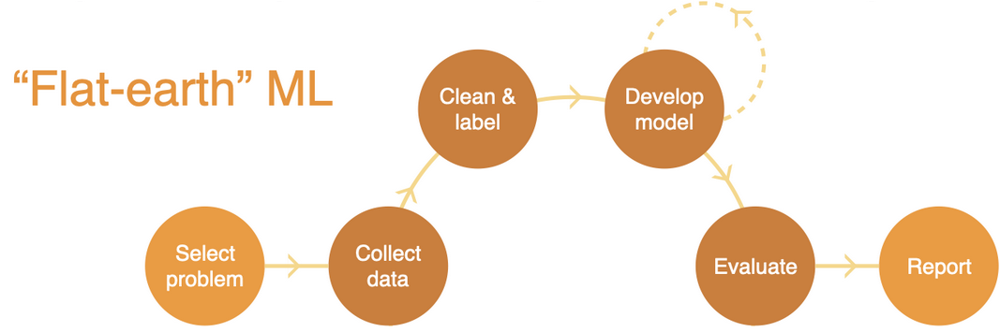
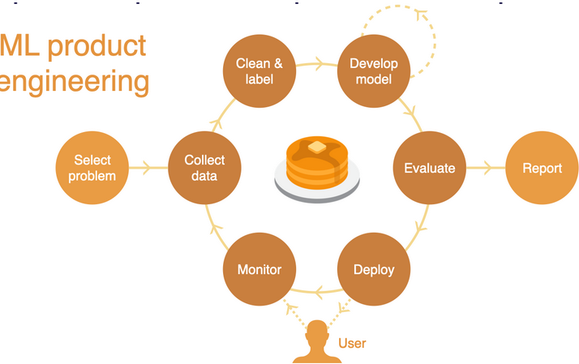

#### Course Vision and when to use ML

- commodification of training of models 

AI Progress

Historically two AI winters(around 1975 and late 2000s)[^1]: the technology didn't live up to its hype

##### ML Powered Products require a different Process

- In academia the the process that is followed to build models is **"flat-earth" ML**  as shown in the picture below and iterating in model development that performs well on the collected dataset and then evaluating on that dataset and finishing off with a report

  

- ML powered products need an outer loop, where after model is deployed into production you measure how the model performs and interacts with real users and then use real-world data to build a data fly-wheel and continue this as part of an outer loop.

  

  ##### When to use Machine Learning

  **ML projects have a higher failure rate than software projects in general**. ML projects fail due to the following reasons

  1. Technically infeasible and poorly scoped
  2. Never make leap to a production environment
  3. Broader organization is not all on the same page about what should be considered criteria for them
  4. Solve problem they set out to solve but not big enough problem to be worth the complexity

  **Their value must outweigh not just the cost of developing them but also the additional complexity that the ML system introduce to the software**

  

[^1]: https://www.cambridgewireless.co.uk/media/uploads/resources/AI%20Group/AIMobility-11.05.17-Cambridge_Consultants-Monty_Barlow.pdf

